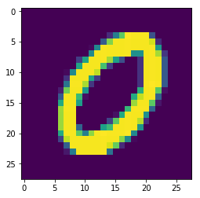

# Handrwritten-Digit-Recognizer

# Build a TensorFlow classifier for recognizing handwritten digits

1. Import MNIST Data using TensorFlow


```python
import tensorflow as tf
from tensorflow.examples.tutorials.mnist import input_data
```


```python
mnist = input_data.read_data_sets("MNIST_data/",one_hot=True)
```
out:
    Extracting MNIST_data/train-images-idx3-ubyte.gz
    Extracting MNIST_data/train-labels-idx1-ubyte.gz
    Extracting MNIST_data/t10k-images-idx3-ubyte.gz
    Extracting MNIST_data/t10k-labels-idx1-ubyte.gz
    

2. Check type of Dataset


```python
type(mnist)
```


out:
    tensorflow.contrib.learn.python.learn.datasets.base.Datasets


3. Array of Training images


```python
mnist.train.images
#4. size of training data
mnist.train.num_examples
```


out:

    55000


5. Visualize the Data


```python
import matplotlib.pyplot as plt
%matplotlib inline
mnist.train.images[1].shape
```


out:
    (784,)


```python
plt.imshow(mnist.train.images[15].reshape(28,28))
```


out:
    <matplotlib.image.AxesImage at 0x1a547431128>





6. Maximum and minimum value of the pixels in the image


```python
mnist.train.images[1].max()
```


out:

    1.0


7. Create the Model


```python
x = tf.placeholder(tf.float32,shape = [None,784])
#24*24 = 784 pixel images
```


```python
W = tf.Variable(tf.zeros([784,10]))
b = tf.Variable(tf.zeros([10]))
```

8. Create the Graph


```python
y = tf.matmul(x,W) +b
#y = Wi*xi+b
y_true = tf.placeholder(tf.float32,[None,10])
```


```python
#Cross Entropy
cross_entropy = tf.reduce_mean(tf.nn.softmax_cross_entropy_with_logits(labels=y_true, logits=y))
optimizer = tf.train.GradientDescentOptimizer(learning_rate=0.5)
```


```python
train = optimizer.minimize(cross_entropy)
```

8. Create the Session


```python
init = tf.global_variables_initializer()
```


```python
with tf.Session() as sess:
    sess.run(init)
    #Train the model for 1000 steps on the training set using built in batch feeder from mnist
    for  step in range(1000):
        batch_x,batch_y=mnist.train.next_batch(1000)
        sess.run(train, feed_dict = {x:batch_x,y_true:batch_y})
#9. Evaluate the Trained model on Test Data
    #Test the trained model
    matches = tf.equal(tf.argmax(y,1),tf.argmax(y_true,1))
    acc = tf.reduce_mean(tf.cast(matches,tf.float32))
    print(sess.run(acc,feed_dict={x:mnist.test.images,y_true:mnist.test.labels}))
```
out:
    0.9212
    The model can recognize handwritten digits of images (28*28=784 pixels)  with accuracy 0.9212 this accuracy can be improved further by training the model. 
